<!--
  GitHub profile README — place this file at the root of a repo named
  EXACTLY your GitHub username (e.g. github.com/neagsom229-lang/neagsom229-lang).
  GitHub renders that special repo's README on your profile page.

  All project links below use the GitHub handle "neagsom229-lang".
  If any project lives under a different account, search & replace that string.
-->

 

 

##  About Me

Junior web developer, passionate about learning new things daily and always curious about how fast technology grows. I build full-stack projects, and I tend to pick each one for what it will force me to learn next.

 

## 🧰 Tech Stack

<table width="100%">
<tr>
<td align="center" width="25%" valign="top">

**Frontend**
  
 
 
 
 
 

</td>
<td align="center" width="25%" valign="top">

**Backend**
  
 
 
 
 
 

</td>
<td align="center" width="25%" valign="top">

**Data & Infra**
  
 
 
 
 
 

</td>
<td align="center" width="25%" valign="top">

**Payments & CV**
  
 
 

</td>
</tr>
</table>

 
## 📌 Featured Projects

<table width="100%">
<tr>
<td width="50%" valign="top">

### 💎 Obsidian
Expense tracker SaaS with a working Stripe billing tier, budgets, recurring transactions, and CSV export — mid-redesign into a glassmorphic bento-grid dashboard.

`React` `Tailwind` `Zustand` `Supabase`

**[View Repo →](https://github.com/neagsom229-lang/Tracker_Pro)**

</td>
<td width="50%" valign="top">

### 🌍 TraceGeo
Identifies a landmark from a photo using the Gemini API, geocodes it with Nominatim, and shows the result on a 3D-globe interface.

`Laravel 11` `Gemini API` `Nominatim`

**[View Repo →](https://github.com/neagsom229-lang/TraceGeo)**

</td>
</tr>
</table>

 

## 📊 GitHub Stats

## 🧊 3D Contribution Calendar

## 🐍 Contribution Activity

 

## 📬 Let's Connect

  

Open to freelance work — locally in Cambodia and on Upwork.
Message me directly on Telegram or Gmail, or open an issue/discussion on any repo above.

 

<i>Thanks for Attention ✨</i>

